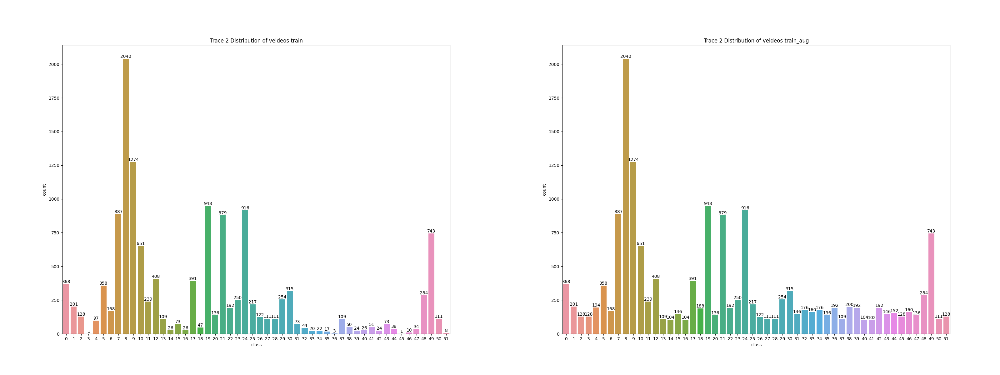
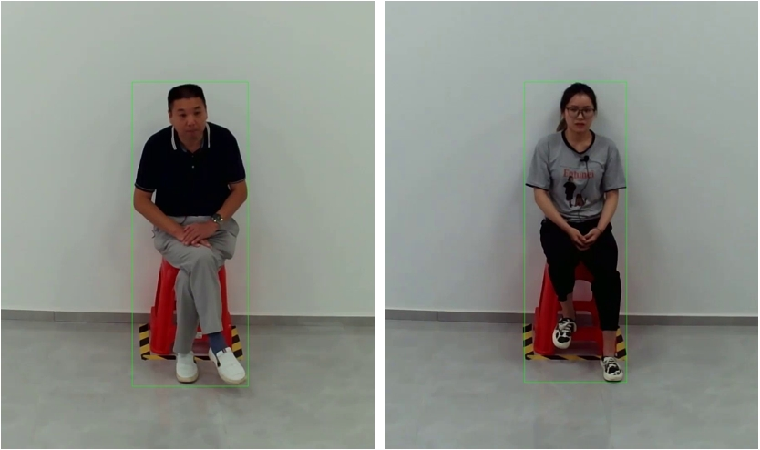

# Solution of 2rd Place for The MAC 2024 Grand Challenge Track 2

## 1. Team member:
Name      | affiliation            |
---       | ---                    |
Chen Wang | China Mobile Shanghai ICT Co.,Ltd |
Xun Mei   | China Mobile Shanghai ICT Co.,Ltd |

## 2. Data preparation

Downlaod Track2 dataset in data or other floder as following:

```
-data
  |-annotations
    |-train.csv
    |-val.csv
    |-test.csv
    |-label_name.txt
    |-category_idx
  |-train
  |-val
  |-test
```


### 2.1 Balance data
Those videos less than 100 are copied to mitigate the severe data imbalance, which is a commonly used trick.

```
python preprocess/data_aug.py
```



### 2.2 Generate annotations
Process the data into the required format.

```
python preprocess/merge_all_vedio.py
python preprocess/generate_json.py
```


### 2.3 Instance Detection

**Pretrained people detector** is employed to locate the interviewed person. Specifically, the bounding box of person instance is detected by YOLOv8x. All the bounding boxes are saved in pickle format.

```
python data/predict_video.py
```

The bounding box are visualized as follows:



## 3. Training

- Before training your model following our tutorial, please make sure that **the path of instance** is right in line 1~4 of *OpenTAD-main/configs/_base_/datasets/multithumos/e2e_train_trunc_test_sw_256x224x224.py*.

- Make sure **the path of model** is right in line 95 and line 165 of *OpenTAD-main/configs/adatad/multi_thumos/e2e_multithumos_videomae_s_768x1_160_adapter.py*.

- Make sure **the path of dataset** in config file. 

```
bash tools/train.sh
```


## 4. Inferance

With corresponding configuration, you can inference model forward and save the results in json format.

```
bash tools/test.sh
```


## 5. Submission


```
python postprocess/ana_result.py
```

