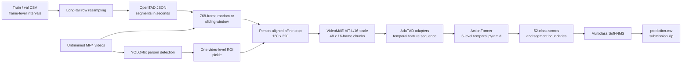

# MAC 2024 Track 2 — 2nd Place Solution

[中文核心说明](README_CN.md)

> Second-place solution for **Multi-label Micro-Action Detection** in MAC 2024 Track 2.

This repository contains the released competition pipeline, not just an OpenTAD fork. Its central idea is to convert an untrimmed video into a **person-aligned temporal sequence**, encode 768 frames with a VideoMAE ViT-L/16-scale backbone and AdaTAD adapters, and use ActionFormer to localize overlapping micro-actions from 52 categories.

## The Core in 30 Seconds

**Input:** an untrimmed video.

**Output:** a set of detections in the form

```text
(video_id, t_start, t_end, class_id, score)
```

The task is temporal detection rather than single-label video classification. Different action classes may overlap in time, so the system preserves every annotated interval independently and predicts multiple class-specific segments for the same video.

The competition solution combines four decisions:

1. **Annotation-level long-tail rebalancing** increases the sampling frequency of classes with fewer than 100 intervals.
2. **Person-aligned decoding** uses YOLOv8x detections to create one ROI per video and crops decoded frames around that ROI.
3. **Parameter-efficient video adaptation** splits a 768-frame window into 48 chunks of 16 frames and processes them with VideoMAE plus adapters.
4. **Multi-scale temporal localization** uses ActionFormer to classify temporal points and regress action boundaries, followed by multiclass Soft-NMS.

## End-to-End Data Flow


```mermaid
flowchart LR
    A[Train / val CSV<br/>frame-level intervals] --> B[Long-tail row resampling]
    B --> C[OpenTAD JSON<br/>segments in seconds]

    D[Untrimmed MP4 videos] --> E[YOLOv8x person detection]
    E --> F[One video-level ROI<br/>pickle]

    C --> G[768-frame random or<br/>sliding window]
    D --> G
    F --> H[Person-aligned affine crop<br/>160 x 320]
    G --> H

    H --> I[VideoMAE ViT-L/16-scale<br/>48 x 16-frame chunks]
    I --> J[AdaTAD adapters<br/>temporal feature sequence]
    J --> K[ActionFormer<br/>6-level temporal pyramid]
    K --> L[52-class scores<br/>and segment boundaries]
    L --> M[Multiclass Soft-NMS]
    M --> N[prediction.csv<br/>submission.zip]
```

## Core Method

### 1. Multi-label temporal formulation

`preprocess/generate_json.py` converts the official CSV annotations from frame indices to temporal segments:

```text
segment = [start_frame / fps, end_frame / fps]
```

Each video keeps a list of independent `{label, segment}` annotations. Overlapping intervals are not merged, which is how the 52-class multi-label task is represented inside OpenTAD. Training and validation use the competition assumption of 30 FPS in the released script; test FPS is read from the CSV.

The generated annotation has this structure:

```json
{
  "database": {
    "video_id": {
      "duration": 12.3,
      "frame": 369,
      "subset": "training",
      "annotations": [
        {"label": "shaking body", "segment": [1.2, 2.1]},
        {"label": "bowing head", "segment": [1.7, 2.4]}
      ]
    }
  }
}
```

### 2. Long-tail rebalancing

The 52 classes are strongly imbalanced. `preprocess/data_aug.py` duplicates annotation rows for each class with fewer than 100 training instances. For a class with `n < 100`, the released rule is:

```text
repeat(n) = floor(log2(100 // n)) + 1
```

The duplicated rows are appended to `train_aug.csv`. This is **sampling rebalancing**, not synthetic frame generation: video pixels are unchanged, while rare temporal annotations are seen more often during training.


### 3. Person-region extraction and aligned crop

`preprocess/predict_video.py` runs YOLOv8x with:

| Setting | Value |
|---|---:|
| Object class | person only (`classes=0`) |
| Confidence threshold | `0.5` |
| IoU threshold | `0.45` |
| Released parallel setup | 64 processes over 4 GPUs |

The script keeps the first detected person box for each decoded frame and reduces the frame boxes to one video-level ROI saved in `trace2_instances_all.pickle`. During loading, `DecordDecodeCrop` converts this box into a fixed-aspect affine crop:

- output resolution: **160 × 320** (`width × height`);
- target aspect ratio: **0.5**;
- ROI expansion: **1.05×**;
- training-only scale jitter: up to roughly **−35% / +17.5%**;
- optional rotation jitter: up to **±5°**;
- horizontal flip, ImgAug, and color jitter are applied afterward.

This person-aligned view suppresses static background and allocates more spatial resolution to subtle body motion.


> **Released-code note:** `predict_video.py` currently applies `np.min(xyxy, axis=0)` to all four box coordinates. This reproduces the competition code. A geometric union box would instead use `min(x1, y1)` and `max(x2, y2)` across frames.

### 4. VideoMAE + AdaTAD temporal encoder

The final configuration is:

```text
OpenTAD-main/configs/adatad/multi_thumos/
└── e2e_multithumos_videomae_s_768x1_160_adapter.py
```

Despite the historical filename containing `videomae_s`, the released model block is ViT-L/16 scale:

| Component | Released configuration |
|---|---|
| Backbone | `VisionTransformerAdapter` |
| Patch / tube input | 16-frame chunks, patch size 16 |
| Transformer size | 1024 dims, 24 blocks, 16 heads |
| Temporal window | 768 frames |
| Chunking | 48 chunks × 16 frames |
| Adapter placement | all 24 transformer blocks |
| Backbone initialization | VideoMAE Kinetics-400 checkpoint |
| Output | 1024-channel temporal sequence interpolated to length 768 |

The backbone processes the long video window chunk-by-chunk. Spatial and within-chunk temporal dimensions are reduced to a 1D feature sequence, the 48 chunk outputs are concatenated, and the sequence is interpolated back to 768 temporal positions for detection.

The optimizer sets the base backbone learning rate to zero and trains the adapters with a higher learning rate. This preserves pretrained video representations while adapting them to fine-grained micro-actions.

### 5. ActionFormer detection head

The VideoMAE sequence is passed to ActionFormer:

- transformer projection: `in_channels=1024`, `arch=(3, 0, 5)`;
- six temporal pyramid levels with strides `1, 2, 4, 8, 16, 32`;
- point-based classification and boundary regression;
- 52 output classes;
- Focal Loss for classification;
- DIoU Loss for temporal boundary regression;
- label smoothing: `0.2`.

Because the detector emits class-specific temporal segments rather than one label for the whole clip, multiple micro-actions can be returned for overlapping time ranges.

### 6. Sliding-window inference and submission decoding

Training samples random 768-frame windows whose overlap with at least one ground-truth segment is at least `0.75`. Validation and test use sliding windows; the inherited overlap ratios are 25% and 50%, respectively.

Predictions are merged with the following released post-processing settings:

| Setting | Value |
|---|---:|
| Pre-NMS threshold | `0.001` |
| Pre-NMS top-k | `8000` |
| Soft-NMS sigma | `0.5` |
| Maximum segments | `8000` |
| Multiclass NMS | enabled |
| Voting threshold | `0.7` |

`postprocess/ana_result.py` maps class names back to the official indices, clamps predictions to the video duration, rounds scores to four decimals, writes `prediction.csv`, and packages it as `submission.zip`.

## Training Configuration at a Glance

| Item | Value |
|---|---|
| Distributed setup | 1 node × 4 processes |
| Batch size | 8 per training process |
| Optimizer | AdamW |
| Detection-head learning rate | `1e-4` |
| Adapter learning rate | `4e-4` |
| Base-backbone learning rate | `0` |
| Weight decay | `0.05` |
| Scheduler | 5-epoch warm-up + cosine annealing |
| Released workflow | 30 epochs |
| Gradient clipping | `1.0` |
| Mixed precision | enabled |
| EMA | enabled |

## Reproducing the Pipeline

### 1. Prepare the data

The released scripts expect this logical layout:

```text
/data/
├── annotations/
│   ├── train.csv
│   ├── val.csv
│   ├── test.csv
│   ├── label_name.txt
│   └── category_idx.txt
├── train/
├── val/
├── test/
└── all/
```

The competition dataset is not redistributed. Obtain it from the official source and follow its license and privacy requirements.

### 2. Rebalance and convert annotations

```bash
python preprocess/data_aug.py
python preprocess/merge_all_vedio.py
python preprocess/generate_json.py
```

Expected outputs include `train_aug.csv`, the consolidated `/data/all` video directory, and `anno_all.json`.

### 3. Extract the person ROI

Download `yolov8x.pt`, update the paths and hardware settings in `preprocess/predict_video.py`, then run:

```bash
python preprocess/predict_video.py
```

Expected output: `/weights/trace2_instances_all.pickle`.

### 4. Update the experiment paths

Review both the final experiment config and its inherited dataset config:

```text
OpenTAD-main/configs/adatad/multi_thumos/e2e_multithumos_videomae_s_768x1_160_adapter.py
OpenTAD-main/configs/_base_/datasets/multithumos/e2e_train_trunc_test_sw_256x224x224.py
```

At minimum, update the annotation, video, ROI pickle, pretrained-weight, checkpoint, and work-directory paths.

### 5. Train and infer

```bash
bash tools/train.sh
bash tools/test.sh
```

Both scripts launch four `torchrun` workers. Adjust `--nproc_per_node`, batch size, workers, and device allocation for your machine.

### 6. Build the submission

```bash
python postprocess/ana_result.py
```

Expected outputs: `postprocess/prediction.csv` and `postprocess/submission.zip`.

## Repository Map

```text
.
├── OpenTAD-main/
│   ├── configs/adatad/multi_thumos/   # final experiment variants
│   └── opentad/                        # temporal detection implementation
├── data/annotations/                   # 52-class mappings and CSV metadata
├── preprocess/
│   ├── data_aug.py                     # rare-class row resampling
│   ├── merge_all_vedio.py              # consolidate train/val/test videos
│   ├── generate_json.py                # CSV frames -> OpenTAD seconds
│   └── predict_video.py                # YOLOv8x -> video-level ROI pickle
├── postprocess/ana_result.py            # detection JSON -> CSV -> ZIP
├── tools/train.sh                       # four-process training
├── tools/test.sh                        # four-process inference
└── figs/                                # README visualizations
```

## Result

| Item | Result |
|---|---|
| Challenge | MAC 2024 Grand Challenge, Track 2 |
| Task | Multi-label Micro-Action Detection |
| Number of classes | 52 |
| Final rank | **2nd place** |
| Spatial focus | YOLOv8x video-level person ROI |
| Temporal encoder | VideoMAE ViT-L/16-scale + AdaTAD adapters |
| Detector | ActionFormer |

The final leaderboard score, per-class metrics, and final checkpoint are not archived in the public repository, so this README does not invent values that cannot be audited.

## Important Limitations

- Paths are hard-coded for the original competition server (`/data`, `/weights`, `/annotations`, and `/OpenTAD-main`).
- The preprocessing launcher assumes 64 CPU processes and four GPUs.
- Train and validation annotation conversion assumes 30 FPS.
- The released ROI reduction uses a coordinate-wise minimum; see the note in the person-region section.
- Exact package versions and the final checkpoint are not included.
- The anonymized README image protects the current view, but the original image remains accessible in earlier Git history.
- The repository does not currently declare an independent license for the competition-specific additions.

## References and Acknowledgements

- [MAC 2024 Track 2 competition](https://www.codabench.org/competitions/3119/)
- [Micro-Action challenge resources](https://github.com/VUT-HFUT/Micro-Action)
- [MMAD: Multi-label Micro-Action Detection in Videos](https://arxiv.org/abs/2407.05311)
- [OpenTAD](https://github.com/sming256/OpenTAD)
- [Ultralytics YOLO](https://github.com/ultralytics/ultralytics)

Thanks to the challenge organizers and the authors of OpenTAD, ActionFormer, AdaTAD, VideoMAE, and Ultralytics YOLO.
