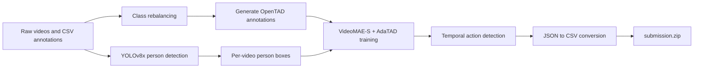
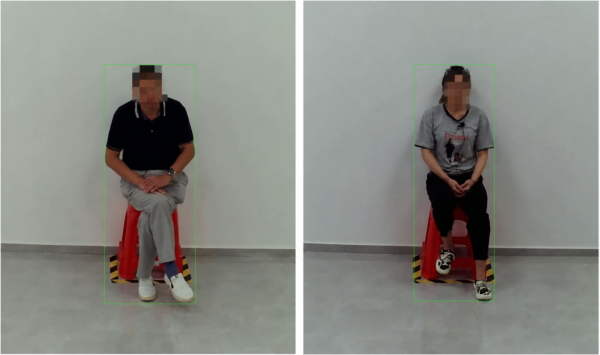
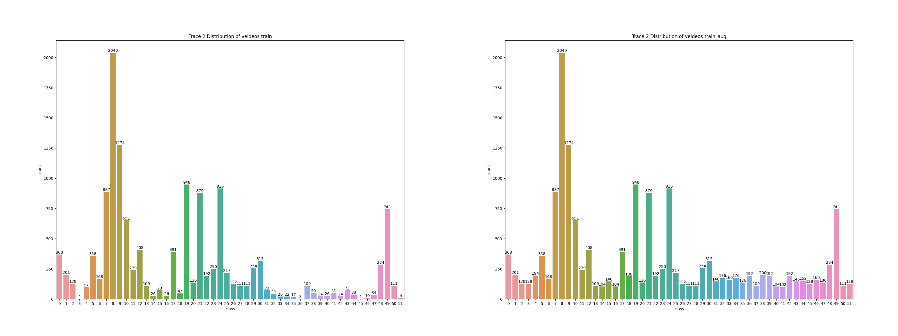

# MAC 2024 Track 2 — 2nd Place Solution

[中文说明](README_CN.md)

> Second-place solution for **Track 2: Multi-label Micro-Action Detection** of the MAC 2024 Grand Challenge.

This repository contains the complete competition pipeline used for data preparation, person-region extraction, temporal action detection, inference, and submission generation. The solution is built on **OpenTAD**, uses a **VideoMAE-S** backbone with an **AdaTAD adapter**, and pre-computes person regions with **YOLOv8x**.

## Highlights

- **2nd-place competition solution** for MAC 2024 Track 2.
- End-to-end workflow from raw videos and annotations to a submission ZIP.
- Class rebalancing for long-tail micro-action categories.
- YOLOv8x-based person-region extraction to reduce background interference.
- OpenTAD-based temporal action detection with VideoMAE-S and AdaTAD.
- Multi-GPU training and inference scripts based on `torchrun`.

## Method Overview


```mermaid
flowchart LR
    A[Raw videos and CSV annotations] --> B[Class rebalancing]
    A --> C[YOLOv8x person detection]
    B --> D[Generate OpenTAD annotations]
    C --> E[Per-video person boxes]
    D --> F[VideoMAE-S + AdaTAD training]
    E --> F
    F --> G[Temporal action detection]
    G --> H[JSON to CSV conversion]
    H --> I[submission.zip]
```

The core pipeline has four stages:

1. **Data preparation** — merge videos, rebalance rare classes, and convert the official annotations to the format required by OpenTAD.
2. **Person-region extraction** — run YOLOv8x on each video and save person bounding boxes as pickle files.
3. **Temporal action detection** — train and evaluate an AdaTAD configuration with a VideoMAE-S backbone.
4. **Submission generation** — convert detection JSON files into the required CSV format and package them as a ZIP archive.

## Visualizations

### Person-region extraction



### Class distribution before and after rebalancing



## Repository Structure

```text
.
├── OpenTAD-main/                 # OpenTAD code and experiment configuration
├── data/
│   └── annotations/              # Annotation metadata tracked by this repository
├── figs/                         # README figures
├── preprocess/
│   ├── data_aug.py               # Long-tail class rebalancing
│   ├── merge_all_vedio.py        # Video-list preparation
│   ├── generate_json.py          # OpenTAD annotation generation
│   └── predict_video.py          # YOLOv8x person-region extraction
├── postprocess/
│   └── ana_result.py             # Detection JSON to submission ZIP
├── tools/
│   ├── train.sh                  # Four-GPU training entry point
│   └── test.sh                   # Four-GPU inference entry point
├── README.md
└── README_CN.md
```

## Environment

The exact competition environment has not yet been frozen in a lock file. The current code expects a Linux environment with:

- Python and PyTorch with distributed training support;
- CUDA-capable GPUs;
- OpenTAD dependencies from `OpenTAD-main`;
- `ultralytics` for YOLOv8x;
- `pandas`, `numpy`, `tqdm`, and related data-processing packages.

Before running the project, review the absolute paths used in the scripts. The original competition code assumes mounted directories such as `/data`, `/weights`, `/annotations`, and `/OpenTAD-main`.

## Data Layout

Place the official Track 2 dataset under a structure equivalent to:

```text
data/
├── annotations/
│   ├── train.csv
│   ├── val.csv
│   ├── test.csv
│   ├── label_name.txt
│   └── category_idx.txt
├── train/
├── val/
└── test/
```

The competition dataset is not redistributed in this repository. Obtain it from the official challenge source and comply with its terms of use.

## Quick Start

### 1. Prepare and rebalance the annotations

```bash
python preprocess/data_aug.py
python preprocess/merge_all_vedio.py
python preprocess/generate_json.py
```

`data_aug.py` resamples categories with fewer than 100 training instances. Adjust the threshold and paths before running it on a different dataset.

### 2. Extract person regions

Download a YOLOv8x checkpoint, update the paths and worker/GPU settings in `preprocess/predict_video.py`, and run:

```bash
python preprocess/predict_video.py
```

The original script is configured for four GPUs and 64 worker processes. Reduce the worker count and remap devices according to the available hardware.

### 3. Configure the temporal detector

Review the following configuration file:

```text
OpenTAD-main/configs/adatad/multi_thumos/
└── e2e_multithumos_videomae_s_768x1_160_adapter.py
```

At minimum, update:

- dataset paths;
- person-instance pickle paths;
- pretrained model paths;
- output and checkpoint directories.

### 4. Train

The provided command launches four distributed workers:

```bash
bash tools/train.sh
```

For a different number of GPUs, edit `--nproc_per_node` in `tools/train.sh`.

### 5. Run inference

Update the checkpoint path in `tools/test.sh`, then run:

```bash
bash tools/test.sh
```

### 6. Generate the submission file

After inference produces `result_detection.json`, update the paths in `postprocess/ana_result.py` and run:

```bash
python postprocess/ana_result.py
```

The script writes a prediction CSV and packages it as `submission.zip`.

## Results

| Item | Result |
|---|---|
| Challenge | MAC 2024 Grand Challenge, Track 2 |
| Task | Multi-label Micro-Action Detection |
| Final ranking | **2nd place** |
| Main model | VideoMAE-S + AdaTAD |
| Person detector | YOLOv8x |

The exact leaderboard score, final checkpoint, and per-class metrics are not currently archived in the public repository. They are listed in the reproducibility roadmap below so that future updates can make the result fully auditable.

## Reproducibility Roadmap

- [ ] Add the exact Python, PyTorch, CUDA, and package versions used for the final submission.
- [ ] Add a configurable YAML or CLI interface to replace hard-coded absolute paths.
- [ ] Publish the final leaderboard score and per-class evaluation results.
- [ ] Add a downloadable checkpoint when competition licensing permits it.
- [ ] Add a short inference demo and qualitative failure cases.
- [ ] Add automated smoke tests for preprocessing and submission generation.

## Known Limitations

- Several scripts use absolute competition-server paths and require local editing.
- `predict_video.py` was designed for a high-core-count, four-GPU server and is not a safe default for a laptop or single-GPU workstation.
- The repository currently does not include the challenge dataset or pretrained checkpoints.
- The repository currently has no explicit open-source license; obtain permission before redistributing substantial portions of the code.

## References and Acknowledgements

- [Official MAC 2024 Track 2 competition page](https://www.codabench.org/competitions/3119/)
- [Micro-Action challenge resources](https://github.com/VUT-HFUT/Micro-Action)
- [MMAD: Multi-label Micro-Action Detection in Videos](https://arxiv.org/abs/2407.05311)
- [OpenTAD](https://github.com/sming256/OpenTAD)
- [Ultralytics YOLO](https://github.com/ultralytics/ultralytics)

Thanks to the challenge organizers and the authors of OpenTAD, AdaTAD, VideoMAE, and Ultralytics YOLO for making this solution possible.
