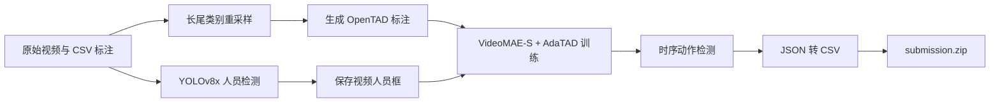

# MAC 2024 Track 2 —— 第二名方案

[English](README.md)

> MAC 2024 Grand Challenge Track 2：**多标签微动作检测（Multi-label Micro-Action Detection）第二名方案**。

本仓库公开了从数据预处理、人员区域提取、时序动作检测，到推理结果后处理与提交文件生成的完整竞赛流程。方案基于 **OpenTAD**，采用 **VideoMAE-S + AdaTAD** 进行时序动作检测，并利用 **YOLOv8x** 预先提取视频中的人员区域。

## 方案亮点

- MAC 2024 Track 2 最终排名 **第二名**；
- 覆盖数据准备、训练、推理和提交文件生成的完整流程；
- 针对长尾类别进行数据重采样，缓解类别不均衡；
- 使用 YOLOv8x 提取人员区域，减少背景干扰；
- 基于 OpenTAD、VideoMAE-S 和 AdaTAD 完成时序动作检测；
- 提供基于 `torchrun` 的多卡训练与推理脚本。

## 整体流程



方案主要包含四个阶段：

1. **数据准备**：合并视频列表、对少样本类别进行重采样，并将官方标注转换为 OpenTAD 所需格式；
2. **人员区域提取**：使用 YOLOv8x 对视频逐帧检测人员，并将结果保存为 pickle 文件；
3. **时序动作检测**：训练以 VideoMAE-S 为骨干网络、采用 AdaTAD 的时序检测模型；
4. **提交文件生成**：将检测结果 JSON 转换为比赛要求的 CSV，并打包为 ZIP 文件。

## 可视化结果

### 人员区域提取示例


### 类别均衡前后对比


## 仓库结构

```text
.
├── OpenTAD-main/                 # OpenTAD 代码及实验配置
├── data/
│   └── annotations/              # 仓库中保留的标注元数据
├── figs/                         # README 图片
├── preprocess/
│   ├── data_aug.py               # 长尾类别重采样
│   ├── merge_all_vedio.py        # 视频列表准备
│   ├── generate_json.py          # 生成 OpenTAD 标注
│   └── predict_video.py          # YOLOv8x 人员区域提取
├── postprocess/
│   └── ana_result.py             # 检测 JSON 转提交 ZIP
├── tools/
│   ├── train.sh                  # 默认四卡训练入口
│   └── test.sh                   # 默认四卡推理入口
├── README.md
└── README_CN.md
```

## 环境说明

最终竞赛环境目前尚未整理为版本锁定文件。现有代码默认运行在 Linux 环境，并依赖：

- 支持分布式训练的 Python 与 PyTorch；
- CUDA GPU；
- `OpenTAD-main` 中对应的 OpenTAD 依赖；
- 用于 YOLOv8x 推理的 `ultralytics`；
- `pandas`、`numpy`、`tqdm` 等数据处理库。

运行前请检查代码中的绝对路径。原始竞赛代码使用了 `/data`、`/weights`、`/annotations` 和 `/OpenTAD-main` 等挂载目录，需要根据本地环境修改或通过容器挂载保持一致。

## 数据目录

将官方 Track 2 数据整理为类似结构：

```text
data/
├── annotations/
│   ├── train.csv
│   ├── val.csv
│   ├── test.csv
│   ├── label_name.txt
│   └── category_idx.txt
├── train/
├── val/
└── test/
```

本仓库不重新分发比赛数据。请从官方渠道获取，并遵守对应的数据使用条款。

## 快速开始

### 1. 准备并均衡训练标注

```bash
python preprocess/data_aug.py
python preprocess/merge_all_vedio.py
python preprocess/generate_json.py
```

其中，`data_aug.py` 会对训练样本少于 100 条的类别进行重采样。迁移到其他数据集时，应根据实际类别分布调整阈值和路径。

### 2. 提取人员区域

下载 YOLOv8x 权重，修改 `preprocess/predict_video.py` 中的数据路径、权重路径、进程数及 GPU 映射，然后运行：

```bash
python preprocess/predict_video.py
```

原始脚本按照四张 GPU、64 个工作进程设计。单卡或普通工作站环境应显著降低进程数，并重新配置设备映射。

### 3. 配置时序动作检测模型

重点检查以下配置文件：

```text
OpenTAD-main/configs/adatad/multi_thumos/
└── e2e_multithumos_videomae_s_768x1_160_adapter.py
```

至少需要修改：

- 数据集路径；
- 人员框 pickle 路径；
- 预训练模型路径；
- 日志、输出和模型权重保存目录。

### 4. 训练

仓库默认启动四个分布式训练进程：

```bash
bash tools/train.sh
```

使用其他 GPU 数量时，请修改 `tools/train.sh` 中的 `--nproc_per_node`。

### 5. 推理

修改 `tools/test.sh` 中的模型权重路径，然后运行：

```bash
bash tools/test.sh
```

### 6. 生成提交文件

推理得到 `result_detection.json` 后，修改 `postprocess/ana_result.py` 中的输入输出路径并运行：

```bash
python postprocess/ana_result.py
```

脚本会生成预测 CSV，并打包为 `submission.zip`。

## 比赛结果

| 项目 | 结果 |
|---|---|
| 比赛 | MAC 2024 Grand Challenge Track 2 |
| 任务 | 多标签微动作检测 |
| 最终排名 | **第二名** |
| 主模型 | VideoMAE-S + AdaTAD |
| 人员检测器 | YOLOv8x |

当前公开仓库尚未保存最终榜单分数、最终模型权重和逐类别指标。为避免给出无法核验的数字，本 README 暂不补写这些结果，后续可依据原始比赛记录继续完善。

## 可复现性完善计划

- [ ] 补充最终提交所使用的 Python、PyTorch、CUDA 及依赖版本；
- [ ] 将硬编码绝对路径改为 YAML 或命令行参数；
- [ ] 补充最终榜单分数及逐类别评测结果；
- [ ] 在比赛许可允许的情况下提供最终模型权重；
- [ ] 增加简短推理演示、成功案例和失败案例；
- [ ] 为预处理和提交文件生成增加自动化冒烟测试。

## 已知限制

- 多个脚本仍使用竞赛服务器上的绝对路径，需要在本地运行前修改；
- `predict_video.py` 面向高核数、四卡服务器设计，不适合作为单卡环境的默认配置；
- 仓库不包含官方数据集和预训练权重；
- 当前仓库尚未添加明确的开源许可证，在复制或重新分发大量代码前应先取得许可。

## 参考与致谢

- [MAC 2024 Track 2 官方比赛页面](https://www.codabench.org/competitions/3119/)
- [Micro-Action Challenge 相关资源](https://github.com/VUT-HFUT/Micro-Action)
- [MMAD: Multi-label Micro-Action Detection in Videos](https://arxiv.org/abs/2407.05311)
- [OpenTAD](https://github.com/sming256/OpenTAD)
- [Ultralytics YOLO](https://github.com/ultralytics/ultralytics)

感谢比赛组织者，以及 OpenTAD、AdaTAD、VideoMAE 和 Ultralytics YOLO 等项目的作者。
