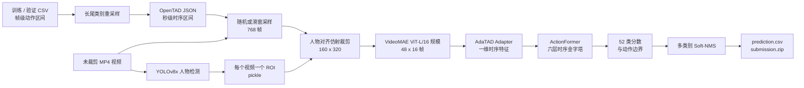

# MAC 2024 Track 2 —— 第二名方案

[English README](README.md)

> MAC 2024 Track 2 **多标签微动作检测（Multi-label Micro-Action Detection）第二名方案**。

本仓库不只是 OpenTAD 的代码镜像，而是比赛方案实际采用的数据处理、人物区域提取、端到端时序检测、推理后处理与提交生成流程。核心思路是：先把长视频转成**以人物为中心的时序输入**，再使用 VideoMAE ViT-L/16 规模骨干与 AdaTAD Adapter 编码 768 帧，最后通过 ActionFormer 定位 52 类可相互重叠的微动作区间。

## 30 秒看懂核心

**输入：** 一段未裁剪视频。

**输出：** 若干条微动作检测结果：

```text
(video_id, t_start, t_end, class_id, score)
```

这不是“整段视频属于哪个类别”的单标签分类，而是**多标签时序检测**：同一时间段可以同时存在多个动作类别，模型需要同时判断类别、开始时间、结束时间和置信度。

方案由四个关键设计组成：

1. **标注级长尾重采样**：提高训练集中少于 100 个区间的类别被采样的频率；
2. **人物对齐的视频解码**：利用 YOLOv8x 为每个视频生成一个人物 ROI，解码后围绕人物区域裁剪；
3. **参数高效的视频适配**：把 768 帧拆成 48 个 16 帧片段，由 VideoMAE 和 Adapter 提取长时序特征；
4. **多尺度时序定位**：使用 ActionFormer 同时完成时序点分类和动作边界回归，再通过多类别 Soft-NMS 合并结果。

## 端到端数据流



## 核心方法

### 1. 多标签时序建模

`preprocess/generate_json.py` 将官方 CSV 中的帧编号转换为秒级区间：

```text
segment = [start_frame / fps, end_frame / fps]
```

每个视频保存一组独立的 `{label, segment}` 标注。相互重叠的动作区间不会被合并，因此同一段时间可以同时对应多个类别。公开脚本在训练集和验证集上固定使用 30 FPS，测试集 FPS 从 CSV 读取。

转换后的核心数据结构如下：

```json
{
  "database": {
    "video_id": {
      "duration": 12.3,
      "frame": 369,
      "subset": "training",
      "annotations": [
        {"label": "shaking body", "segment": [1.2, 2.1]},
        {"label": "bowing head", "segment": [1.7, 2.4]}
      ]
    }
  }
}
```

模型最终输出的是“类别相关的时序区间”，而不是一个视频级 multi-hot 标签；这也是方案能够检测重叠微动作的基础。

### 2. 长尾类别重采样

52 个类别的样本数量差异很大。`preprocess/data_aug.py` 对训练区间少于 100 条的类别重复写入标注。若某类有 `n < 100` 条标注，公开代码使用：

```text
repeat(n) = floor(log2(100 // n)) + 1
```

重复后的标注写入 `train_aug.csv`。这一步只改变训练采样分布，**不会生成新视频帧**；它让稀有类别对应的时序区间在训练中出现得更频繁。


### 3. 人物 ROI 提取与对齐裁剪

`preprocess/predict_video.py` 使用 YOLOv8x 检测人物：

| 参数 | 公开配置 |
|---|---:|
| 检测类别 | 仅人物（`classes=0`） |
| 置信度阈值 | `0.5` |
| IoU 阈值 | `0.45` |
| 并行设置 | 64 个进程、4 张 GPU |

脚本在每个解码帧中保留第一个人物框，再把一个视频内的帧级检测结果压缩为一个视频级 ROI，保存到 `trace2_instances_all.pickle`。

数据加载阶段，`DecordDecodeCrop` 根据该 ROI 对所有采样帧执行仿射裁剪：

- 输出分辨率：**160 × 320**（宽 × 高）；
- 固定目标宽高比：**0.5**；
- ROI 向外扩张：**1.05 倍**；
- 训练时尺度扰动：约 **−35% 到 +17.5%**；
- 随机旋转：最高 **±5°**；
- 随后继续使用水平翻转、ImgAug 和颜色扰动。

这样做的目的，是减少背景对微小动作的干扰，并把更多空间分辨率分配给人物身体。


> **公开代码说明：** `predict_video.py` 对四个框坐标统一使用了 `np.min(xyxy, axis=0)`，这里按比赛代码原样说明。若目标是计算几何意义上的跨帧并集框，应对左上角使用最小值，对右下角使用最大值。

### 4. VideoMAE + AdaTAD 时序编码器

最终实验配置位于：

```text
OpenTAD-main/configs/adatad/multi_thumos/
└── e2e_multithumos_videomae_s_768x1_160_adapter.py
```

虽然历史文件名中包含 `videomae_s`，但代码中的实际网络规模对应 ViT-L/16：

| 组件 | 实际配置 |
|---|---|
| 骨干类型 | `VisionTransformerAdapter` |
| 输入单元 | 16 帧、patch size 16 |
| Transformer 规模 | 1024 维、24 层、16 个注意力头 |
| 时序窗口 | 768 帧 |
| 分块方式 | 48 块 × 16 帧 |
| Adapter 位置 | 24 个 Transformer Block 全部插入 |
| 骨干初始化 | VideoMAE Kinetics-400 预训练权重 |
| 输出 | 插值到长度 768 的 1024 通道时序特征 |

处理过程如下：

1. 768 帧窗口被拆成 48 个 16 帧片段；
2. VideoMAE 分别提取片段特征；
3. 对空间维和片段内部时间维做平均，得到每个片段的一维特征；
4. 拼接 48 个片段的输出；
5. 插值为长度 768 的连续时序特征，交给 ActionFormer。

优化器将基础骨干学习率设为 0，并以 `4e-4` 学习率更新 Adapter。这样既保留预训练视频表征，又能针对微动作进行适配。

### 5. ActionFormer 时序检测头

VideoMAE 输出由 ActionFormer 负责定位：

- 投影层：`in_channels=1024`，`arch=(3, 0, 5)`；
- 六层时序特征金字塔，步长为 `1, 2, 4, 8, 16, 32`；
- 基于时序点同时进行类别预测和左右边界回归；
- 输出类别数：52；
- 分类损失：Focal Loss；
- 边界回归损失：DIoU Loss；
- 标签平滑：`0.2`。

不同类别会产生各自的时序区间，因此模型可以在同一时间范围内返回多个微动作，而不是强制选择唯一类别。

### 6. 滑窗推理与提交结果生成

训练阶段随机采样 768 帧窗口，并要求窗口与至少一个真实动作区间的覆盖率不低于 `0.75`。验证和测试采用滑动窗口，继承配置中的重叠比例分别为 25% 和 50%。

跨窗口预测使用以下后处理配置：

| 参数 | 数值 |
|---|---:|
| NMS 前置信度阈值 | `0.001` |
| NMS 前保留数量 | `8000` |
| Soft-NMS sigma | `0.5` |
| 最大区间数 | `8000` |
| 多类别 NMS | 开启 |
| Voting 阈值 | `0.7` |

`postprocess/ana_result.py` 将类别名称映射回官方类别编号，把预测区间限制在视频时长内，将分数保留四位小数，生成 `prediction.csv`，最后打包为 `submission.zip`。

## 训练关键参数

| 项目 | 公开配置 |
|---|---|
| 分布式训练 | 单机 4 进程 |
| 每个训练进程的 batch size | 8 |
| 优化器 | AdamW |
| 检测部分学习率 | `1e-4` |
| Adapter 学习率 | `4e-4` |
| 基础骨干学习率 | `0` |
| Weight decay | `0.05` |
| 学习率策略 | 5 个 epoch warm-up + cosine annealing |
| 公开工作流 | 30 个 epoch |
| 梯度裁剪 | `1.0` |
| 混合精度 | 开启 |
| EMA | 开启 |

## 复现流程

### 1. 准备数据

公开脚本默认使用以下逻辑目录：

```text
/data/
├── annotations/
│   ├── train.csv
│   ├── val.csv
│   ├── test.csv
│   ├── label_name.txt
│   └── category_idx.txt
├── train/
├── val/
├── test/
└── all/
```

本仓库不重新分发比赛数据，请从官方渠道获取，并遵守相应的数据许可与隐私要求。

### 2. 重采样并生成 OpenTAD 标注

```bash
python preprocess/data_aug.py
python preprocess/merge_all_vedio.py
python preprocess/generate_json.py
```

主要输出包括 `train_aug.csv`、合并后的 `/data/all` 视频目录和 `anno_all.json`。

### 3. 提取人物 ROI

下载 `yolov8x.pt`，修改 `preprocess/predict_video.py` 中的路径、进程数和 GPU 映射，然后运行：

```bash
python preprocess/predict_video.py
```

预期输出：`/weights/trace2_instances_all.pickle`。

### 4. 修改实验路径

需要同时检查最终实验配置及其继承的数据集配置：

```text
OpenTAD-main/configs/adatad/multi_thumos/e2e_multithumos_videomae_s_768x1_160_adapter.py
OpenTAD-main/configs/_base_/datasets/multithumos/e2e_train_trunc_test_sw_256x224x224.py
```

至少需要修改标注、视频、人物 ROI、预训练权重、恢复权重和实验输出目录。

### 5. 训练与推理

```bash
bash tools/train.sh
bash tools/test.sh
```

两个脚本默认启动 4 个 `torchrun` 进程。请根据机器调整 `--nproc_per_node`、batch size、数据加载进程和设备分配。

### 6. 生成提交文件

```bash
python postprocess/ana_result.py
```

预期输出：`postprocess/prediction.csv` 和 `postprocess/submission.zip`。

## 仓库结构

```text
.
├── OpenTAD-main/
│   ├── configs/adatad/multi_thumos/   # 最终实验及模型规模变体
│   └── opentad/                        # 时序检测实现
├── data/annotations/                   # 52 类映射和 CSV 标注元数据
├── preprocess/
│   ├── data_aug.py                     # 稀有类别标注重采样
│   ├── merge_all_vedio.py              # 合并 train/val/test 视频目录
│   ├── generate_json.py                # CSV 帧编号 -> OpenTAD 秒级区间
│   └── predict_video.py                # YOLOv8x -> 视频级 ROI pickle
├── postprocess/ana_result.py            # 检测 JSON -> CSV -> ZIP
├── tools/train.sh                       # 四进程训练入口
├── tools/test.sh                        # 四进程推理入口
└── figs/                                # README 可视化图片
```

## 比赛结果

| 项目 | 结果 |
|---|---|
| 比赛 | MAC 2024 Grand Challenge Track 2 |
| 任务 | 多标签微动作检测 |
| 类别数 | 52 |
| 最终排名 | **第二名** |
| 空间聚焦 | YOLOv8x 视频级人物 ROI |
| 时序编码器 | VideoMAE ViT-L/16 规模 + AdaTAD Adapter |
| 检测器 | ActionFormer |

当前公开仓库没有保存最终榜单分数、逐类别指标和最终权重，因此本文不补写无法核验的数字。

## 重要限制

- 多处路径仍硬编码为比赛服务器目录：`/data`、`/weights`、`/annotations`、`/OpenTAD-main`；
- 人物检测脚本默认使用 64 个 CPU 进程和 4 张 GPU；
- 训练集和验证集标注转换固定假设为 30 FPS；
- 视频级 ROI 使用逐坐标最小值归约，具体见人物区域章节的代码说明；
- 尚未提供精确依赖版本、最终模型权重和可直接运行的单卡配置；
- 当前 README 图片已经匿名化，但旧原图仍可从早期 Git 历史中恢复；
- 比赛方案的新增代码目前没有单独声明开源许可证。

## 参考与致谢

- [MAC 2024 Track 2 官方比赛](https://www.codabench.org/competitions/3119/)
- [Micro-Action Challenge 相关资源](https://github.com/VUT-HFUT/Micro-Action)
- [MMAD: Multi-label Micro-Action Detection in Videos](https://arxiv.org/abs/2407.05311)
- [OpenTAD](https://github.com/sming256/OpenTAD)
- [Ultralytics YOLO](https://github.com/ultralytics/ultralytics)

感谢比赛组织者，以及 OpenTAD、ActionFormer、AdaTAD、VideoMAE 和 Ultralytics YOLO 的作者。
